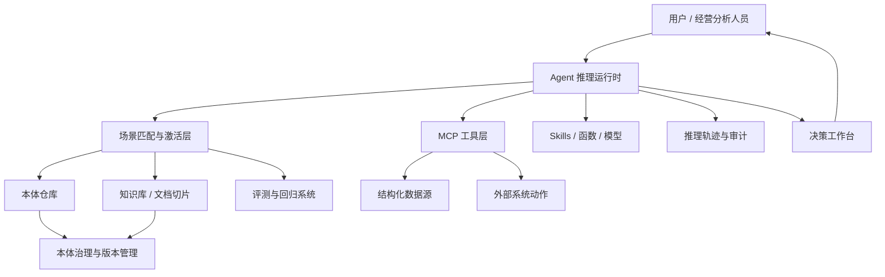

# 面向大模型推理的经营决策本体平台白皮书

## 1. 一句话定位

本平台不是传统知识图谱、BI、RAG 或工作流系统的简单拼接，而是一个面向大模型推理的企业经营决策语义操作层。

它通过本体定义企业的对象、关系、指标、规则、行为与场景，通过 MCP 连接结构化数据源，通过知识库接入非结构化文档，通过 Agent 调度本体、数据、技能与工作流，最终让大模型在可追溯、可评测、可治理的约束下完成经营分析和决策建议。

核心主张：

> 本体负责定义，大模型负责推理，工具负责取数与计算，评测负责约束质量。

## 2. 背景与问题

企业经营决策长期依赖四类系统：

1. BI 与数据仓库：擅长指标呈现和固定报表，但不擅长理解复杂业务语义、规则例外和跨系统因果解释。
2. 规则引擎与工作流：擅长确定性流程，但规则维护成本高，面对开放式经营问题时灵活性不足。
3. 知识库与 RAG：擅长文档检索和问答，但缺少结构化业务对象、规则激活机制和可评测的推理链。
4. 传统本体与知识图谱：擅长形式化概念、关系与一致性约束，但主要面向推理机、校验器和图查询，不是为大模型阅读和组装规则而设计。

大模型出现后，企业不再只需要“查数”和“查文档”，而是希望系统能够回答更接近经营者的问题：

- 为什么本月毛利下降？
- 哪些客户续约风险最高？
- 哪些 SKU 会造成库存或履约风险？
- 某个合规规则是否适用于当前订单？
- 如果调整价格、补货、预算或产能，会影响哪些指标？
- 当前异常更可能是需求变化、供应延迟、定价策略还是渠道结构变化导致？

这些问题的共同特点是：它们既需要结构化数据，也需要文档规则；既需要指标计算，也需要业务语义；既需要推理，也需要证据与责任链。

## 3. 核心洞察

传统本体的推理消费者通常是确定性推理机或约束校验器。因此，传统本体强调形式化表达、逻辑可判定、一致性检查和公理化定义。

面向大模型时，消费者发生变化。本体不再只是机器推理器的输入，而是大模型理解企业语义、选择规则、调用工具和生成推理轨迹的语义契约。

因此，本平台采用新的分工：

- 本体：定义对象、关系、指标、行为、规则、场景和证据要求。
- 大模型：识别场景、选择规则、组装推理链、解释结果、提出建议。
- 工具与技能：执行数据查询、批量计算、模型预测、模拟、文件生成、外部系统操作。
- 评测系统：验证场景匹配、规则引用、结论准确性、推理轨迹稳定性。
- 治理系统：管理版本、权限、来源、审核、变更影响和责任归属。

这意味着，本体的评价标准也发生变化：

- 从“逻辑上是否完备”转向“语义上是否清晰、覆盖是否充分、歧义是否足够少”。
- 从“是否可判定”转向“是否可评测”。
- 从“推理过程由黑盒引擎保证”转向“推理过程显式可追溯”。

## 4. 产品原则

### 4.1 场景优先

平台的一等中心不是类、表、文档或 Agent，而是经营场景。

场景定义了：

- 当前问题属于哪类决策；
- 哪些对象、关系、指标和规则会被激活；
- 需要访问哪些数据源和知识库；
- 可以调用哪些技能、工具或工作流；
- 输出应该包含哪些证据、推理轨迹和行动建议；
- 如何构造评测集。

场景层是降低复杂度的核心。大模型不应该在完整企业本体中自由搜索，而应该先匹配场景，再加载该场景相关的本体切片、事实数据、规则和工具。

### 4.2 原子规则，可组合推理

规则不应该写成复杂巨型规则。每条规则只处理一个最小判断，通常只跨一跳关系或一个局部条件。

复合推理由大模型按场景组装多条原子规则完成。

这样做有三个好处：

- 降低大模型多跳推理负担；
- 让推理轨迹更容易检查；
- 让规则复用和评测更简单。

### 4.3 推理归大模型，计算归工具

平台不把规则引擎作为主要业务推理核心，但也不要求大模型承担所有精确计算。

推荐分工：

- 大模型判断“应该查什么、算什么、套用什么规则、如何解释”。
- 工具执行 SQL 查询、聚合计算、批量校验、预测模型、模拟和外部动作。
- 本体定义这些工具的适用场景、输入输出、约束和语义含义。

这保留了大模型灵活组装规则的能力，同时避免让大模型承担不擅长的精确大规模计算。

### 4.4 可追溯优先于形式证明

平台接受大模型推理的非确定性，但要求输出结构化推理轨迹：

- 匹配了哪个场景；
- 使用了哪些事实；
- 激活了哪些规则；
- 调用了哪些工具；
- 每一步得到了什么中间结论；
- 最终结论依赖哪些证据；
- 哪些地方存在不确定性或缺失数据。

### 4.5 评测是一等公民

每个场景都必须伴随评测集。评测集不是上线后的补丁，而是本体设计、Agent 编排和模型选择的基础设施。

平台至少评测：

- 场景匹配准确率；
- 规则选择准确率；
- 工具调用正确性；
- 结论准确性；
- 推理轨迹完整性；
- 证据引用正确性；
- 多次运行一致性；
- 本体变更后的回归表现。

## 5. 目标用户

### 5.1 经营分析人员

使用自然语言提出经营问题，查看指标异动解释、原因归因、证据链和建议动作。

### 5.2 业务专家

维护业务对象、规则、场景、指标口径和例外条件，审核大模型抽取出的本体草案。

### 5.3 数据团队

接入结构化数据源，维护字段映射、指标计算口径、权限和数据质量。

### 5.4 AI / 平台团队

维护 Agent、模型、skills、工作流、评测集、回归测试和系统治理。

### 5.5 管理者

查看高层经营洞察、风险预警、决策建议和可执行动作。

## 6. 核心能力

### 6.1 MCP 结构化数据连接器

平台通过 MCP 将企业系统暴露为可调用、可解释、可治理的数据能力：

- 数据库：PostgreSQL、MySQL、SQL Server、Oracle、ClickHouse 等。
- 企业系统：ERP、CRM、WMS、MES、财务系统、HR 系统。
- 分析系统：数据仓库、指标平台、BI、Lakehouse。
- SaaS：飞书、钉钉、Salesforce、Shopify、HubSpot 等。

连接器不只是技术连接，还要提供语义元数据：

- 表、字段、主键、外键；
- 字段业务含义；
- 数据粒度；
- 刷新频率；
- 权限范围；
- 可用查询能力；
- 可执行动作；
- 数据质量状态。

### 6.2 知识库与文档本体化

文档上传后，平台不只做向量切片，而是识别文档中的语义元素：

- 概念定义；
- 指标口径；
- 业务规则；
- 例外条件；
- 流程步骤；
- 合同条款；
- 合规要求；
- 操作指南；
- 历史案例。

切片结果应保留：

- 来源文档；
- 页码或段落；
- 生效时间；
- 适用对象；
- 适用场景；
- 置信度；
- 是否已审核。

### 6.3 本体生成与治理

大模型可从数据源 schema、文档、历史问答、流程材料中生成候选本体。

本体元素包括：

- 对象；
- 属性；
- 场景化关系；
- 指标；
- 行为；
- 原子规则；
- 场景；
- 技能绑定；
- 证据要求；
- 评测用例。

所有候选元素进入审核流程，不直接成为生产本体。

### 6.4 Agent 推理运行时

运行时的标准流程：

1. 用户提出问题。
2. Agent 判断问题所属场景。
3. 检索场景相关本体切片、规则、指标和文档证据。
4. 识别需要查询的数据源。
5. 调用 MCP 工具、skills 或工作流获取事实。
6. 组装推理链。
7. 输出结论、证据、行动建议和不确定性。
8. 将推理轨迹写入审计记录。
9. 可选：将新案例沉淀为评测用例。

### 6.5 自定义工作流

用户可以将本体、skills、数据源和规则嵌入工作流：

- 定时经营分析；
- 异常自动归因；
- 风险预警；
- 合规审查；
- 采购建议；
- 销售机会识别；
- 管理周报生成；
- 审批前智能检查。

工作流既可以由人触发，也可以由事件触发。

### 6.6 决策工作台

最终界面不应只是聊天框，而应支持经营决策工作台：

- 问题输入；
- 场景识别结果；
- 关键指标卡片；
- 证据列表；
- 推理链；
- 备选方案；
- 风险提示；
- 建议动作；
- 反馈与纠错；
- 一键生成报告或触发工作流。

## 7. 参考架构

## 8. 与相邻系统的区别

### 8.1 与 BI 的区别

BI 主要回答“发生了什么”。本平台进一步回答“为什么发生、适用什么规则、接下来可以怎么做”。

### 8.2 与普通 RAG 的区别

普通 RAG 检索文档片段。本平台检索本体切片、规则、指标口径、数据源能力和证据，并要求输出可评测的推理轨迹。

### 8.3 与传统知识图谱的区别

传统知识图谱通常以实体关系查询为核心。本平台以经营场景为核心，让大模型动态组装规则和数据调用。

### 8.4 与规则引擎的区别

规则引擎执行确定性规则。本平台将规则写成可读、可组合的原子语义单元，由大模型按场景选择、组装和解释。

### 8.5 与通用 Agent 平台的区别

通用 Agent 平台强调工具调用。本平台强调企业语义约束、场景激活、本体治理、评测回归和决策可追溯。

## 9. 关键风险

### 9.1 深链推理衰减

大模型在多跳、多分支规则组装时可能丢失条件或跳步。需要通过原子规则、场景切片、结构化推理轨迹和评测集控制风险。

### 9.2 大规模精确计算不稳定

大模型不适合承担批量精算。平台必须将计算拆给工具执行，并让大模型只负责计算意图、结果解释和规则选择。

### 9.3 场景数量膨胀

场景从几十个增长到上千个后，场景匹配本身会成为复杂问题。需要引入场景检索、层级分类、相似场景合并和评测约束。

### 9.4 本体漂移

自然语言定义容易随业务变化而过期。平台需要版本管理、审核流程、来源追踪、变更影响分析和定期回归。

### 9.5 非确定性与责任边界

大模型输出存在波动。平台必须明确哪些结论可自动执行，哪些只能作为建议，哪些必须人工审核。

## 10. 成功指标

平台早期不应只看 DAU 或问答次数，而应看语义与决策质量：

- 场景匹配准确率；
- 本体抽取审核通过率；
- 规则选择准确率；
- 工具调用成功率；
- 结论准确率；
- 推理轨迹可接受率；
- 回归测试通过率；
- 业务专家纠错率；
- 决策建议采纳率；
- 分析任务耗时下降比例。

## 11. 路线图

### 阶段 1：单场景闭环

完成一个经营或合规场景的端到端闭环：

- 文档上传；
- 数据源接入；
- 本体生成；
- 人工审核；
- Agent 推理；
- 结构化轨迹；
- 评测集；
- 回归测试。

### 阶段 2：多场景扩展

支持多个业务场景，并引入场景检索、规则复用、指标共享和跨场景治理。

### 阶段 3：工作流与自动化

将 Agent 分析能力嵌入定时任务、事件触发、审批流程和经营报告。

### 阶段 4：企业级治理

支持多租户、权限、审计、版本、灰度发布、模型评估、合规控制和组织协作。

## 12. 当前最重要的假设

本平台是否成立，取决于以下假设是否能被验证：

1. 场景层能够显著降低大模型推理复杂度。
2. 原子规则加组合推理能在真实业务中保持足够稳定。
3. 本体生成和人工审核的成本低于传统知识工程。
4. 评测集可以有效约束非确定性推理。
5. 业务用户愿意使用带推理轨迹的决策建议，而不只是查看报表。
6. 工具计算与大模型推理的分工不会破坏产品体验。

这些假设需要在 MVP 阶段被实证检验。
