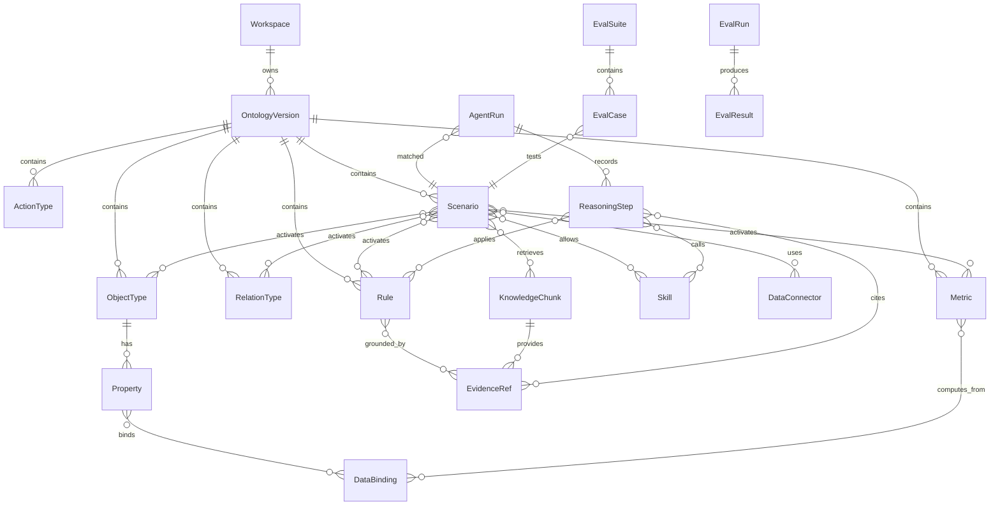

# 核心数据模型

## 1. 设计目标

核心数据模型要支撑一个面向大模型推理的经营决策平台，而不是传统的静态知识图谱。

它需要同时表达：

- 企业业务对象；
- 对象属性与数据源绑定；
- 场景化关系；
- 指标口径；
- 原子业务规则；
- 行为与动作；
- 技能与工具；
- 知识库证据；
- 场景激活逻辑；
- Agent 推理轨迹；
- 评测用例；
- 版本、审核、权限和审计。

设计原则：

- 所有元素必须有自然语言定义。
- 所有元素必须可追溯到来源。
- 所有推理相关元素必须可评测。
- 关系和规则必须带场景语义。
- 数据、文档、规则、技能和 Agent 输出要能互相引用。

## 2. 顶层实体图



## 3. 共同字段

所有核心实体建议包含以下通用字段：

```yaml
id: 全局唯一 ID
workspace_id: 工作空间 ID
name: 名称
display_name: 展示名
description: 面向大模型和人的自然语言定义
status: draft | active | deprecated | archived
version: 语义版本或递增版本
created_by: 创建人
created_at: 创建时间
updated_by: 更新人
updated_at: 更新时间
source_refs: 来源引用
review_status: pending | approved | rejected | needs_revision
owner: 业务负责人或数据负责人
tags: 标签
metadata: 扩展字段
```

`description` 是一等字段，不是备注。面向大模型的本体里，定义写得是否清楚，直接影响推理质量。

## 4. Workspace

工作空间是企业、租户或项目级边界。

```yaml
Workspace:
  id: string
  name: string
  industry: string
  default_language: zh-CN
  timezone: Asia/Shanghai
  governance_policy_id: string
```

## 5. OntologyVersion

本体版本是发布和回归测试的基本单位。

```yaml
OntologyVersion:
  id: string
  workspace_id: string
  name: string
  version: string
  base_version_id: string | null
  status: draft | staging | production | archived
  change_summary: string
  release_notes: string
  eval_gate_status: not_run | passed | failed | waived
```

关键要求：

- 生产环境 Agent 应绑定到明确的本体版本。
- 本体变更必须触发相关场景的回归评测。
- 支持灰度发布和回滚。

## 6. ObjectType

业务对象类型，例如客户、订单、SKU、门店、合同、设备、供应商、产线。

```yaml
ObjectType:
  id: object.customer
  name: Customer
  display_name: 客户
  description: 购买产品或服务、与企业存在交易或合同关系的组织或个人。
  aliases:
    - 客户
    - 购买方
    - 甲方
  properties:
    - property.customer.id
    - property.customer.name
    - property.customer.segment
  participates_in_relations:
    - relation.customer_has_contract
    - relation.customer_places_order
  lifecycle_states:
    - prospect
    - active
    - churn_risk
    - inactive
  examples:
    - name: 某制造企业客户
      note: 年采购额超过 1000 万的 B2B 客户。
```

设计要求：

- 必须说明对象是什么，不是什么。
- 必须列出典型别名，帮助大模型做语义匹配。
- 必须说明参与哪些关系和场景。

## 7. Property

属性描述对象的字段、枚举、计算值或派生状态。

```yaml
Property:
  id: property.material.origin_country
  object_type_id: object.material
  name: origin_country
  display_name: 原产国
  description: 物料被视为生产或形成的国家，用于运输、关务和合规判断。
  data_type: string
  cardinality: one
  allowed_values: null
  required: false
  sensitivity: internal
  data_bindings:
    - binding.erp_material_country
```

关键字段：

- `data_type`: string | number | boolean | date | datetime | enum | money | object_ref | list | json
- `cardinality`: one | many
- `sensitivity`: public | internal | confidential | restricted
- `semantic_role`: identifier | status | category | measure | timestamp | owner | geography

## 8. RelationType

关系必须是场景化的。关系不只表达 A 与 B 有连接，还要表达何时成立、在哪些场景下可用、是否有时间有效性。

```yaml
RelationType:
  id: relation.material_has_part
  name: hasPart
  display_name: 包含子物料
  description: 物料 A 在其物料清单中直接包含物料 B。
  source_object_type_id: object.material
  target_object_type_id: object.material
  direction: source_to_target
  cardinality: many_to_many
  relation_kind: structural
  validity:
    temporal: true
    effective_from_property: valid_from
    effective_to_property: valid_to
  scenario_conditions:
    - scenario_id: scenario.transport_compliance_review
      condition: 始终成立，用于判断物料结构中的危险性传递。
    - scenario_id: scenario.production_planning
      condition: 仅当 BOM 版本处于生效状态时成立。
  inverse_relation_id: relation.material_is_part_of
```

`relation_kind` 可选：

- structural：结构性关系，例如 BOM、组织架构；
- transactional：交易关系，例如下单、付款；
- ownership：归属关系；
- temporal：时间关系；
- causal：因果或影响关系；
- responsibility：责任或负责人关系；
- contextual：强依赖场景的关系。

## 9. Metric

经营决策平台必须把指标作为一等公民。

```yaml
Metric:
  id: metric.gross_margin_rate
  name: gross_margin_rate
  display_name: 毛利率
  description: 衡量销售收入扣除销售成本后的利润占收入比例，用于评估产品、客户或渠道盈利质量。
  formula_text: (销售收入 - 销售成本) / 销售收入
  formula_ast:
    op: divide
    left:
      op: subtract
      left: metric.sales_revenue
      right: metric.cost_of_goods_sold
    right: metric.sales_revenue
  grain:
    dimensions:
      - product
      - customer
      - region
      - month
  unit: percentage
  owner: finance_team
  data_bindings:
    - binding.dwh_gross_margin_rate
  scenario_ids:
    - scenario.margin_drop_analysis
```

关键要求：

- 指标必须有业务口径和计算口径。
- 指标必须声明粒度、维度和时间窗口。
- 指标必须能追溯到数据源。
- 指标变更必须触发相关场景评测。

## 10. Rule

规则是面向大模型推理的原子规则。

```yaml
Rule:
  id: rule.hazard_propagation_one_hop
  name: R1_危险性一跳传递
  description: 如果物料 X 直接包含物料 Y，且 Y 是危险品或已被标记为含危险子件，则 X 应被标记为含危险子件。
  scenario_tags:
    - scenario.transport_compliance_review
  condition:
    text: 物料 X 通过 hasPart 直接包含物料 Y，且 Y.is_hazardous 为真，或 Y 已被标记为“含危险子件”。
    structured:
      all:
        - relation: relation.material_has_part
          source: X
          target: Y
        - any:
            - property: property.material.is_hazardous
              object: Y
              equals: true
            - derived_fact: contains_hazardous_part
              object: Y
              equals: true
  result:
    text: 标记 X 为“含危险子件”。
    structured:
      assert_fact:
        object: X
        fact: contains_hazardous_part
        value: true
  atomicity: one_hop
  references:
    object_types:
      - object.material
    relation_types:
      - relation.material_has_part
    properties:
      - property.material.is_hazardous
  examples:
    - input: 成品 A 直接包含零件 C，C 是危险品。
      expected_reasoning: C 是危险品，因此 A 被标记为含危险子件。
      expected_result: A.contains_hazardous_part = true
  evidence_refs:
    - evidence.doc.transport_rule_page_3
```

规则设计要求：

- 一条规则只做一个判断。
- 必须带场景标签。
- 必须列出引用对象、关系和属性。
- 必须至少有一个正例。
- 复杂规则应拆成多个原子规则。

## 11. Scenario

场景是本平台最重要的聚合实体。

```yaml
Scenario:
  id: scenario.transport_compliance_review
  name: 运输合规审查
  description: 在物料出库运输前，判断其是否需要特殊运输条件、关务申报或危险品处理。
  business_goal: 降低运输合规风险，避免危险品或特殊监管货物违规出库。
  trigger_patterns:
    - 用户询问某物料是否需要特殊运输条件。
    - 订单即将出库。
    - 物料运输方式或目的地发生变化。
  activated_object_types:
    - object.material
    - object.factory
    - object.shipment_order
  activated_relation_types:
    - relation.material_has_part
    - relation.material_produced_in
  activated_metrics: []
  activated_rules:
    - rule.hazard_propagation_one_hop
    - rule.origin_hazard_export_declaration
  allowed_skills:
    - skill.query_material_bom
    - skill.query_material_master
  allowed_connectors:
    - connector.erp_material
    - connector.wms_shipment
  evidence_policy:
    require_rule_source: true
    require_data_source: true
    require_reasoning_trace: true
  output_contract_id: contract.transport_compliance_answer
  eval_suite_id: eval.transport_compliance_v1
```

场景应支持层级：

```yaml
ScenarioHierarchy:
  parent: scenario.supply_chain_decision
  children:
    - scenario.transport_compliance_review
    - scenario.inventory_replenishment
    - scenario.supplier_delay_risk
```

## 12. ActionType

行为描述可执行动作模板，不等同于规则。

```yaml
ActionType:
  id: action.create_purchase_suggestion
  name: 创建采购建议
  description: 当库存风险超过阈值且补货规则满足时，生成采购建议供采购人员审核。
  parameters:
    - name: sku_id
      type: string
      required: true
    - name: suggested_quantity
      type: number
      required: true
    - name: reason
      type: string
      required: true
  preconditions:
    - SKU 存在且处于可采购状态。
    - 当前用户有采购建议创建权限。
  effects:
    - 在采购系统中生成一条待审核建议。
  execution_mode: human_approval_required
  bound_skill_id: skill.create_purchase_suggestion
```

执行模式：

- suggestion_only：只给建议；
- human_approval_required：人工确认后执行；
- automatic_allowed：满足条件可自动执行；
- disabled：当前不可执行。

## 13. Skill

Skill 是 Agent 可调用能力，包括查询、计算、预测、模拟、文档生成和外部动作。

```yaml
Skill:
  id: skill.query_material_bom
  name: 查询物料 BOM
  description: 根据物料 ID 查询其直接子物料及 BOM 版本。
  skill_type: mcp_tool
  input_schema:
    material_id: string
    bom_version: string | null
  output_schema:
    material_id: string
    parts:
      - part_id: string
        quantity: number
        valid_from: date
        valid_to: date | null
  allowed_scenarios:
    - scenario.transport_compliance_review
    - scenario.production_planning
  side_effect: false
  requires_approval: false
```

`skill_type` 可选：

- mcp_tool；
- sql_query；
- python_function；
- model_inference；
- workflow；
- external_api；
- report_generator。

## 14. DataConnector 与 DataBinding

### 14.1 DataConnector

```yaml
DataConnector:
  id: connector.erp_material
  name: ERP 物料主数据
  connector_type: mcp
  description: 提供物料、工厂、BOM、危险品标志和原产国等主数据。
  capabilities:
    - query
    - lookup
  freshness:
    refresh_mode: daily
    last_sync_at: datetime
  permission_policy_id: policy.erp_material_read
```

### 14.2 DataBinding

DataBinding 将本体元素绑定到真实数据。

```yaml
DataBinding:
  id: binding.material_origin_country
  target_type: property
  target_id: property.material.origin_country
  connector_id: connector.erp_material
  source:
    database: erp
    table: material_master
    column: origin_country
  join_keys:
    - ontology_property: property.material.id
      source_column: material_id
  transformation: trim_and_upper_country_code
  quality_checks:
    - not_null_rate >= 0.98
```

## 15. KnowledgeDocument 与 KnowledgeChunk

```yaml
KnowledgeDocument:
  id: doc.transport_policy_2026
  title: 运输合规政策 2026
  document_type: policy
  uploaded_by: user.business_owner
  effective_from: 2026-01-01
  effective_to: null
  status: active
```

```yaml
KnowledgeChunk:
  id: chunk.transport_policy_2026_p3_c2
  document_id: doc.transport_policy_2026
  chunk_type: rule_definition
  text: 若出口物料含危险子件且原产国为中国，应进行危险品出境申报。
  page: 3
  semantic_tags:
    - 运输合规
    - 危险品
    - 出境申报
  linked_ontology_elements:
    - rule.origin_hazard_export_declaration
    - object.material
  embedding_ref: vector.xxx
  review_status: approved
```

## 16. EvidenceRef

证据引用将规则、结论和来源连接起来。

```yaml
EvidenceRef:
  id: evidence.transport_rule_page_3
  source_type: knowledge_chunk
  source_id: chunk.transport_policy_2026_p3_c2
  quote: 若出口物料含危险子件且原产国为中国，应进行危险品出境申报。
  usage: rule_grounding
  confidence: 0.94
```

证据可来自：

- 文档片段；
- 数据查询结果；
- 数据表元数据；
- 用户输入；
- 历史案例；
- 外部系统返回；
- 人工审核意见。

## 17. AgentRun 与 ReasoningStep

每次 Agent 分析都必须记录结构化轨迹。

```yaml
AgentRun:
  id: run.20260601.001
  user_id: user.analyst
  question: 物料 A 是否需要危险品出境申报？
  matched_scenario_id: scenario.transport_compliance_review
  ontology_version_id: ontology.v1.2.0
  status: completed
  final_answer: 物料 A 需要危险品出境申报。
  confidence: 0.86
  created_at: datetime
```

```yaml
ReasoningStep:
  id: step.001
  agent_run_id: run.20260601.001
  step_order: 1
  step_type: scenario_match
  description: 用户询问运输前是否需要特殊申报，匹配到运输合规审查场景。
  inputs:
    question: 物料 A 是否需要危险品出境申报？
  outputs:
    scenario_id: scenario.transport_compliance_review
  cited_evidence_refs: []
```

```yaml
ReasoningStep:
  id: step.004
  agent_run_id: run.20260601.001
  step_order: 4
  step_type: rule_application
  applied_rule_id: rule.hazard_propagation_one_hop
  description: C 是危险品，B 直接包含 C，因此 B 被标记为含危险子件。
  inputs:
    facts:
      - B hasPart C
      - C.is_hazardous = true
  outputs:
    derived_fact: B.contains_hazardous_part = true
```

`step_type` 可选：

- scenario_match；
- ontology_retrieval；
- data_query；
- tool_call；
- rule_application；
- metric_calculation；
- evidence_check；
- conclusion；
- uncertainty_assessment；
- action_recommendation。

## 18. OutputContract

不同场景需要不同输出结构。

```yaml
OutputContract:
  id: contract.transport_compliance_answer
  scenario_id: scenario.transport_compliance_review
  required_sections:
    - conclusion
    - matched_scenario
    - facts_used
    - rules_applied
    - reasoning_trace
    - evidence
    - uncertainty
    - recommended_actions
  json_schema:
    type: object
    required:
      - conclusion
      - reasoning_trace
      - evidence
```

## 19. EvalSuite、EvalCase、EvalRun

### 19.1 EvalSuite

```yaml
EvalSuite:
  id: eval.transport_compliance_v1
  scenario_id: scenario.transport_compliance_review
  name: 运输合规审查评测集 v1
  purpose: 评测场景匹配、危险性传递规则、产地叠加规则和推理轨迹。
  status: active
```

### 19.2 EvalCase

```yaml
EvalCase:
  id: evalcase.transport.001
  scenario_id: scenario.transport_compliance_review
  input:
    question: 成品 A 包含 B，B 包含 C，C 是危险品，A 原产国中国。A 是否需要特殊运输条件？
    facts:
      - A hasPart B
      - B hasPart C
      - C.is_hazardous = true
      - A.origin_country = 中国
  expected:
    matched_scenario_id: scenario.transport_compliance_review
    applied_rules:
      - rule.hazard_propagation_one_hop
      - rule.hazard_propagation_one_hop
      - rule.origin_hazard_export_declaration
    final_conclusion: A 需要危险品出境申报。
    required_trace_points:
      - C 危险导致 B 含危险子件
      - B 含危险子件导致 A 含危险子件
      - A 原产国为中国触发出境申报
  grading:
    conclusion_weight: 0.5
    rule_selection_weight: 0.2
    trace_weight: 0.2
    evidence_weight: 0.1
```

### 19.3 EvalRun

```yaml
EvalRun:
  id: evalrun.20260601.001
  eval_suite_id: eval.transport_compliance_v1
  ontology_version_id: ontology.v1.2.0
  model_id: gpt-x
  prompt_version_id: prompt.transport.v3
  started_at: datetime
  status: completed
  summary:
    pass_rate: 0.92
    conclusion_accuracy: 0.96
    trace_accuracy: 0.88
    scenario_accuracy: 0.98
```

## 20. 权限与治理模型

建议权限粒度：

- workspace；
- ontology version；
- scenario；
- connector；
- skill；
- document；
- agent run；
- action execution。

角色建议：

- Admin：系统管理员；
- Ontology Designer：本体设计者；
- Business Reviewer：业务审核人；
- Data Steward：数据负责人；
- Analyst：分析用户；
- Executor：动作执行者；
- Auditor：审计人员。

关键治理规则：

- 未审核本体不能进入生产版本。
- 生产本体变更必须跑评测。
- 高风险动作必须人工审批。
- Agent 输出必须保存推理轨迹。
- 涉及敏感数据的证据引用必须脱敏或受权限控制。

## 21. 最小可实现数据子集

MVP 不需要一次实现完整模型。第一期建议实现：

- Workspace
- OntologyVersion
- ObjectType
- Property
- RelationType
- Rule
- Scenario
- Skill
- DataConnector
- DataBinding
- KnowledgeDocument
- KnowledgeChunk
- AgentRun
- ReasoningStep
- EvalSuite
- EvalCase
- EvalRun

Metric、ActionType、复杂权限和多版本灰度可以在第二阶段增强。
