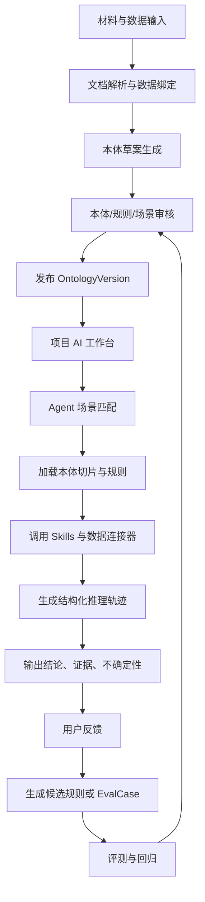
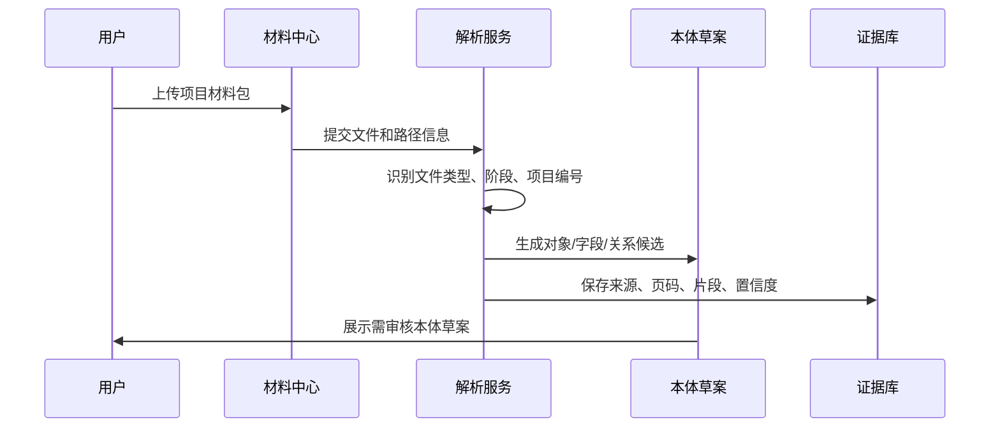
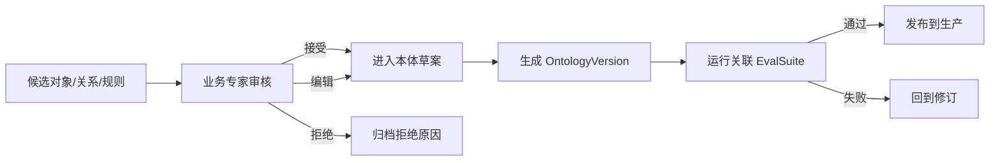
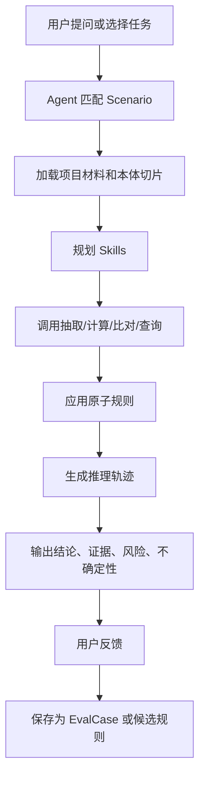
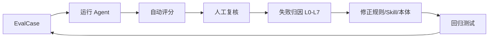

# Onto Pro 平台产品需求文档

版本：v0.2  
日期：2026-06-02  
状态：一期需求确认稿  
文档范围：平台级 PRD，面向第一批金融客户落地与后续开发拆解

## 1. 文档定位

本文定义 Onto Pro 第一阶段平台产品需求。它不是单一金融客户场景方案，也不是通用技术白皮书，而是把前序文档中的产品判断、核心数据模型、金融客户评测方案和技术架构图收敛成可开发、可验收、可迭代的产品需求。

相关文档：

| 文档 | 作用 |
| --- | --- |
| `00-项目备忘录.md` | 记录项目核心判断：本体负责定义，大模型负责推理，工具负责取数与计算，评测负责约束质量 |
| `01-产品概念白皮书.md` | 说明平台定位、产品原则、目标用户和通用能力 |
| `02-核心数据模型.md` | 定义 Workspace、OntologyVersion、Scenario、Rule、Skill、AgentRun、EvalCase 等核心实体 |
| `03-MVP场景闭环PRD.md` | 记录早期通用 MVP 闭环思路 |
| `04-金融客户场景与评测方案.md` | 定义金融客户第一批场景、P0/P1/P2 评测和能力边界 |
| `Word版本/金融客户场景与评测方案.docx` | 面向业务沟通的精简 Word 版本 |

本文的读者包括产品、设计、研发、算法、本体工程、客户交付、测试和项目管理人员。

## 2. 产品一句话定位

Onto Pro 是一个面向大模型推理的业务本体平台，用场景化本体、原子规则、工具调用、证据链和评测闭环，把企业文档和业务数据转成可审计、可复用、可持续改进的 AI 业务语义操作层。

对第一批金融客户而言，Onto Pro 的落地形态是：

> 一个项目级 AI 工作台，帮助金融业务人员完成材料解析、本体草案生成、尽调风控、合同一致性审查、放款前置检查、上会问答和评测回归。

## 3. 背景与问题

第一批金融客户已有或正在建设统一业务系统，覆盖流程审批、项目台账、材料归档、报表填报、合同流转、权限审计等能力。Onto Pro 不应替代这些系统，而应作为旁路语义层存在。

客户当前痛点集中在五类问题：

| 问题 | 现状 | Onto Pro 应解决的部分 |
| --- | --- | --- |
| 材料多且散 | 项目材料分布在审批表、合同、评估报告、征信、票据、面签、登记证明等文件中 | 自动识别材料类型、阶段、项目归属和缺失项 |
| 规则靠人记 | 合规控制点、合同条款、评审会要求、放款条件难以结构化复用 | 把制度和条款转成可审核原子规则 |
| 跨文档一致性难 | 同一项目在合同、审批表、评估报告、票据、通知书中的主体、金额、日期可能不一致 | 建立对象、关系、状态和证据链，检出冲突 |
| 上会问答压力大 | 领导追问风险可控原因、抵押覆盖、担保情况、需关注事项 | 基于证据回答“为什么”，保留推理轨迹 |
| AI 能力边界不清 | 不知道模型解析到本体第几层会失真 | 用 P0/P1/P2 和 L0-L7 分层评测定位边界 |

## 4. 产品目标

### 4.1 第一阶段目标

第一阶段要证明一个闭环：

> 金融项目材料进入平台后，系统可以生成可审核本体草案，并让 Agent 在明确场景下调用工具、应用规则、引用证据、输出结构化结论，再把人工反馈沉淀为评测用例。

第一阶段目标不追求覆盖全部金融业务，而是优先跑通租赁和保理样板。

### 4.2 成功标准

| 目标 | 成功标准 |
| --- | --- |
| 材料语义化 | 能把清水绿岸/港城建设等项目材料识别到项目、阶段、材料类型和核心对象 |
| 本体草案 | 能从材料清单、审批表、合同、风控意见中生成对象、关系、状态、规则候选 |
| 场景推理 | 能在 S1/S3/S5/S6/S7 场景中输出带证据的结构化结论 |
| 跨文档一致性 | 能在金额、主体、合同编号、日期、账户、抵押物坐落等关键字段上发现冲突 |
| 评测闭环 | 能创建、运行、对比 EvalCase，并定位失真发生在 L0-L7 哪一层 |
| 治理闭环 | 本体、规则、Skill、证据、AgentRun、EvalRun 均有版本和审计记录 |

## 5. 非目标

第一阶段明确不做以下事情：

| 非目标 | 原因 |
| --- | --- |
| 不替代客户统一业务系统 | 客户已有流程、台账、合同、权限、报表系统；Onto Pro 做语义增强 |
| 不自动作出放款、授信、通过/拒绝等最终业务决定 | 金融场景高风险，必须保留人工审核 |
| 不一开始覆盖所有 14 个金融场景 | 先跑通租赁闭环，再扩展保理和贷后 |
| 不把本体做成传统大而全知识图谱 | 场景切片优先，避免大模型在全量图谱中无约束推理 |
| 不让大模型承担精确大规模计算 | 财务指标、额度、抵押覆盖、报表汇总必须交给工具或确定性计算 |
| 不把 OCR/视觉失败归因于本体推理失败 | 需要把输入质量和本体推理分开评测 |

## 6. 用户角色

| 角色 | 核心任务 | 主要页面 |
| --- | --- | --- |
| 业务专家 | 审核本体草案、规则、场景、评测用例，确认 AI 结论 | 本体工作台、规则工作台、评测中心 |
| 风控/法务人员 | 做尽调审查、合同审查、放款前置检查、上会问答 | 项目 AI 工作台、合同审查页、证据页 |
| 客户经理/项目经理 | 上传材料、查看项目风险摘要、补充缺失材料 | 项目工作台、材料中心 |
| 数据/系统负责人 | 接入台账、报表、材料系统、外部查询接口，维护字段映射 | 数据连接器、Skill 管理 |
| AI/平台管理员 | 管理模型、Prompt、Skill、本体版本、权限、审计、回归测试 | 平台设置、运行日志、评测中心 |
| 管理者/领导 | 查看项目摘要、关键风险、证据引用和追问回答 | 上会问答、项目摘要页 |

## 7. 核心概念

| 概念 | 定义 |
| --- | --- |
| Workspace | 客户或组织级工作空间，是数据、权限、本体和项目的边界 |
| Project | 金融业务项目，例如融资租赁项目、保理项目、不良资产包项目 |
| Scenario | 场景，是平台的一等中心，决定激活哪些对象、关系、规则、Skill 和输出结构 |
| OntologyVersion | 本体版本，是 Agent 运行和回归评测的发布单位 |
| ObjectType | 业务对象类型，例如项目、主体、合同、抵押物、应收账款、发票、材料 |
| RelationType | 业务关系类型，例如项目-承租人、合同-抵押物、应收账款-买方 |
| State | 对象状态，例如已签署、已登记、已放款、缺失、需复核 |
| Rule | 原子业务规则，例如材料缺失、抵押覆盖、合同编号一致、放款前置条件 |
| Skill | Agent 可调用的能力，例如 OCR、字段抽取、财务计算、合同比对、外部查询 |
| EvidenceRef | 证据引用，连接文档片段、数据结果、规则来源和结论 |
| AgentRun | 一次 Agent 推理运行记录，包含问题、场景、工具调用、规则、证据、结论 |
| EvalCase | 单条评测用例，用于验证场景匹配、抽取、关系、规则、结论和证据 |

## 8. 产品原则

1. 场景优先。Agent 必须先匹配场景，再加载场景切片，不允许在全量本体中自由推理。
2. 原子规则。规则必须小、清楚、可引用、可测试，复杂判断由 Agent 组合。
3. 证据优先。没有证据的结论必须标记为推断、缺失或需人工复核。
4. 工具负责确定性。计算、查询、比对和批量校验由 Skill 或数据工具完成。
5. 可追溯优先于自动化。金融高风险动作默认只给建议，不自动执行。
6. 评测是一等公民。每个可上线场景必须绑定 EvalSuite。
7. 边界显式化。系统必须说明失真发生在文档、字段、关系、状态、规则、跨文档、事件还是决策层。

## 9. 总体架构



技术架构应保留七层能力：

| 层 | 产品含义 |
| --- | --- |
| Ontology Definition | 对象、属性、关系、状态、指标、规则、场景、证据策略 |
| Scenario | 场景识别、场景切片、输出契约、评测套件 |
| Runtime State | 项目材料状态、对象实例状态、Agent 中间状态 |
| Reasoning Graph | 工具调用、规则应用、证据引用和中间结论构成的推理图 |
| LLM Agent | 负责场景匹配、计划、规则组合、解释、不确定性表达 |
| Evaluation | P0/P1/P2、L0-L7、回归测试、差异对比 |
| Feedback | 人工反馈、规则候选、Skill 改进、评测用例沉淀 |

## 10. 一期范围

### 10.1 一期场景范围

一期以融资租赁为主线，保理作为并行样板。

| 场景 | 是否一期 | 原因 |
| --- | --- | --- |
| S1 项目材料归档与本体草案生成 | 是 | 所有后续场景的入口 |
| S3 融资租赁尽调与风险审查 | 是 | 金融客户第一批高价值主场景 |
| S5 合同模板审查与跨合同一致性校验 | 是 | 法务风控明确痛点，适合 L5 评测 |
| S6 放款前置条件与实施管控 | 是 | 明确门控场景，适合规则化 |
| S7 上会材料摘要与领导问答 | 是 | 演示价值高，能验证证据链和多轮问答 |
| S4 保理贸易背景真实性与四符合审查 | 并行样板 | 用古城建设保理项目验证跨文档真实性 |
| S2 主体准入与舆情核验 | 依赖外部接口后进入 | 需要工商、司法、舆情、黑名单等数据源 |
| S8-S12 | 暂缓 | 等一期闭环稳定后扩展 |
| S13/S14 | 横向能力部分纳入 | 反馈沉淀和文本脱敏必须从一期开始 |

### 10.2 一期能力范围

| 能力 | P0 必须 | P1 目标 | P2 探索 |
| --- | --- | --- | --- |
| 文档解析 | DOCX、XLSX、原生 PDF 文本抽取 | 扫描 PDF 接 OCR | 图片、公章、人脸识别 |
| 材料归档 | 材料类型、阶段、项目归属 | 多文件夹、多编号冲突提示 | 模糊命名、低质扫描件 |
| 本体草案 | 对象、字段、关系、规则候选 | 跨文档对象合并 | 隐含关系推断 |
| 场景推理 | S1/S3/S5/S6 结构化输出 | S7 多轮问答 | 事件驱动和决策建议 |
| 证据引用 | 文件、页码、字段、条款 | 工具结果和规则来源 | 冲突证据权重 |
| 评测 | 手工 EvalCase、单场景运行 | 回归对比、失败归因 | 自动生成边界用例 |

## 11. 核心用户流程

### 11.1 项目材料入库流程



验收要求：

| 编号 | 需求 |
| --- | --- |
| FR-001 | 用户可以按项目上传 DOCX、PDF、XLSX、图片或文件夹材料 |
| FR-002 | 系统必须识别材料类型、业务阶段、项目编号和来源路径 |
| FR-003 | 系统必须为每个抽取字段保留来源文件、页码或单元格位置 |
| FR-004 | 系统必须对低置信度、扫描件、模糊文件名标记 `needs_review` |
| FR-005 | 用户可以手工修正材料类型、项目归属和阶段 |

### 11.2 本体草案审核与发布流程



验收要求：

| 编号 | 需求 |
| --- | --- |
| FR-006 | 本体元素必须支持 `draft/pending_review/approved/rejected/production/deprecated` 状态 |
| FR-007 | 未审核本体元素不得进入生产版本 |
| FR-008 | 发布本体版本前必须运行关联评测，失败时必须展示失败用例 |
| FR-009 | 生产 AgentRun 必须绑定明确的 OntologyVersion |
| FR-010 | 用户可以查看本体版本之间的新增、修改、删除和影响场景 |

### 11.3 项目 AI 工作台流程



验收要求：

| 编号 | 需求 |
| --- | --- |
| FR-011 | 每次用户任务必须显示匹配场景和置信度 |
| FR-012 | Agent 只能调用当前场景允许的 Skill |
| FR-013 | Agent 输出必须包含事实、规则、推理轨迹、证据、不确定性和建议动作 |
| FR-014 | 当证据不足或输入冲突时，系统必须提示人工复核，不得给确定结论 |
| FR-015 | 用户可以对结论、证据、规则应用和遗漏项进行反馈 |
| FR-016 | 反馈可以转成候选 EvalCase 或候选规则，但不得自动进入生产 |

### 11.4 评测与回归流程



验收要求：

| 编号 | 需求 |
| --- | --- |
| FR-017 | 用户可以创建 EvalSuite 和 EvalCase |
| FR-018 | EvalCase 必须记录来源文件、输入、期望对象、期望关系、期望规则、期望结论和证据点 |
| FR-019 | 评测结果必须按场景匹配、对象抽取、关系抽取、规则选择、结论、证据分别评分 |
| FR-020 | 失败用例必须标注失真层级：L0-L7 |
| FR-021 | 本体或 Skill 变更后必须支持对比两次 EvalRun |

## 12. 功能需求

### 12.1 工作空间与项目管理

| 编号 | 优先级 | 需求 |
| --- | --- | --- |
| FR-101 | P0 | 支持创建 Workspace，设置客户名称、行业、默认语言、权限策略 |
| FR-102 | P0 | 支持创建 Project，记录项目类型、项目编号、项目名称、客户主体、业务阶段 |
| FR-103 | P0 | Project 下必须聚合材料、对象实例、规则命中、AgentRun、EvalCase |
| FR-104 | P1 | 支持项目编号冲突提示，例如同一材料包出现 `RZ053/RZ048` |
| FR-105 | P1 | 支持项目之间复用主体、合同模板、规则和材料类型 |

### 12.2 材料中心

| 编号 | 优先级 | 需求 |
| --- | --- | --- |
| FR-201 | P0 | 支持项目材料上传、列表、预览、删除、重新解析 |
| FR-202 | P0 | 支持材料类型识别：审批表、合同、评估报告、征信报告、票据、面签表、权证、材料清单 |
| FR-203 | P0 | 支持材料完整性检查，输出缺失材料、已上传材料、需复核材料 |
| FR-204 | P0 | 支持结构化字段抽取：主体、金额、日期、合同编号、坐落、面积、估值、期限、收益率 |
| FR-205 | P1 | 支持跨文件对象合并和冲突提示 |
| FR-206 | P1 | 支持 OCR 队列和 OCR 失败标记 |
| FR-207 | P2 | 支持公章、人脸、手写修改、图片类证明的视觉识别标记 |

### 12.3 本体工作台

| 编号 | 优先级 | 需求 |
| --- | --- | --- |
| FR-301 | P0 | 支持查看和编辑 ObjectType、Property、RelationType、State、Rule、Scenario、Skill |
| FR-302 | P0 | 每个本体元素必须有自然语言定义、来源、状态、负责人和版本 |
| FR-303 | P0 | 支持从材料解析结果生成候选本体元素 |
| FR-304 | P0 | 支持业务专家接受、编辑、拒绝候选元素 |
| FR-305 | P1 | 支持本体元素影响分析，展示被哪些场景、规则、评测用例引用 |
| FR-306 | P1 | 支持 YAML/JSON 结构化视图 |
| FR-307 | P2 | 支持对象关系图可视化和推理图可视化 |

### 12.4 场景与规则工作台

| 编号 | 优先级 | 需求 |
| --- | --- | --- |
| FR-401 | P0 | 支持配置 Scenario 的触发模式、激活对象、激活关系、激活规则、允许 Skill、输出契约 |
| FR-402 | P0 | 支持配置规则：条件、结果、适用场景、证据来源、硬拦截/软预警/人工复核 |
| FR-403 | P0 | 一条规则必须可被单独评测 |
| FR-404 | P0 | 场景必须绑定默认 OutputContract |
| FR-405 | P1 | 支持规则冲突检测，例如同一条件下一个规则硬拦截、另一个规则仅预警 |
| FR-406 | P1 | 支持从用户反馈生成候选规则 |
| FR-407 | P2 | 支持规则组装路径推荐和规则覆盖率分析 |

### 12.5 Skill 与数据连接器

| 编号 | 优先级 | 需求 |
| --- | --- | --- |
| FR-501 | P0 | 支持注册 Skill，定义名称、说明、输入 Schema、输出 Schema、适用场景、是否有副作用 |
| FR-502 | P0 | 一期必须支持文档抽取、材料完整性、财务计算、合同比对、放款条件检查等本地 Skill |
| FR-503 | P0 | Skill 调用结果必须写入 ReasoningStep |
| FR-504 | P1 | 支持外部查询 Skill，例如工商、司法、黑名单、中登登记、发票校验 |
| FR-505 | P1 | 支持 DataBinding，将本体属性绑定到客户台账、报表或数据库字段 |
| FR-506 | P2 | 支持 Skill 版本管理和回归影响分析 |

### 12.6 项目 AI 工作台

| 编号 | 优先级 | 需求 |
| --- | --- | --- |
| FR-601 | P0 | 支持围绕单个项目提问和执行预置任务 |
| FR-602 | P0 | 支持材料归档、本体草案、尽调风控、合同审查、放款前置、上会问答五类任务入口 |
| FR-603 | P0 | Agent 输出必须结构化展示：结论、风险、事实、规则、证据、轨迹、不确定性 |
| FR-604 | P0 | 用户可以展开每一步推理，查看调用的 Skill、输入输出和证据 |
| FR-605 | P1 | 支持多轮追问，并保持项目上下文、证据和结论一致性 |
| FR-606 | P1 | 支持导出上会摘要、合同审查报告、放款条件矩阵 |
| FR-607 | P2 | 支持项目级风险雷达和对象关系图 |

### 12.7 评测中心

| 编号 | 优先级 | 需求 |
| --- | --- | --- |
| FR-701 | P0 | 支持 EvalSuite 列表、EvalCase 列表、单条运行、批量运行 |
| FR-702 | P0 | 支持评测维度：场景、对象、关系、状态、规则、结论、证据、输出格式 |
| FR-703 | P0 | 支持 L0-L7 失真层级标签 |
| FR-704 | P1 | 支持 P0/P1/P2 用例分组和通过率统计 |
| FR-705 | P1 | 支持两次 EvalRun 差异对比 |
| FR-706 | P1 | 支持从 AgentRun 一键保存为 EvalCase |
| FR-707 | P2 | 支持自动生成边界用例和覆盖率分析 |

### 12.8 模拟推演

模拟推演是后续模块，一期只预留模型、接口和入口，不进入主开发路径。

| 编号 | 优先级 | 需求 |
| --- | --- | --- |
| FR-801 | P2 | 支持创建 SimulationScenario，定义推演目标、适用项目类型、可调参数和输出指标 |
| FR-802 | P2 | 支持基于单个项目做 What-if 推演，例如抵押物估值下降、回款延期、放款条件豁免、规则阈值变化 |
| FR-803 | P2 | 支持注入模拟风险事件，例如新增诉讼、查封、逾期、担保失效、核心买方付款延迟 |
| FR-804 | P2 | 推演运行必须复用项目事实、本体对象、关系、状态、规则和 Skill，不另建一套业务逻辑 |
| FR-805 | P2 | 推演结果必须输出变化前后差异、命中规则变化、风险等级变化、影响路径和证据/假设来源 |
| FR-806 | P2 | 推演结论必须明确标记为模拟结果，不得与真实业务状态混淆 |
| FR-807 | P2 | 支持把一次推演结果保存为 SimulationRun，并可与 AgentRun、EvalCase 建立关联 |

### 12.9 治理、权限与审计

| 编号 | 优先级 | 需求 |
| --- | --- | --- |
| FR-901 | P0 | AgentRun 必须记录用户、时间、问题、模型、本体版本、Prompt 版本、Skill 调用、证据和结论 |
| FR-902 | P0 | 本体和规则变更必须记录创建人、审核人、发布时间和变更摘要 |
| FR-903 | P0 | 支持敏感字段标记，例如身份证、手机号、征信报告、公章、个人信息 |
| FR-904 | P0 | 高风险动作默认禁用自动执行 |
| FR-905 | P1 | 支持角色权限：管理员、业务专家、项目用户、只读用户 |
| FR-906 | P1 | 支持脱敏视图和原文视图权限控制 |
| FR-907 | P2 | 支持企业审计导出和合规留痕 API |

## 13. 页面需求

### 13.1 首页/项目列表

目标：让用户快速进入金融项目。

必须展示：

| 区域 | 内容 |
| --- | --- |
| 项目列表 | 项目编号、项目名称、项目类型、主体、阶段、材料完成率、风险状态、最近运行 |
| 筛选 | 项目类型、阶段、风险等级、负责人、更新时间 |
| 快捷入口 | 新建项目、上传材料、进入评测中心、本体工作台 |

### 13.2 项目工作台

目标：成为金融客户第一阶段的核心页面。

布局建议：

| 区域 | 内容 |
| --- | --- |
| 左侧导航 | 材料、对象、关系、规则、审查任务、问答、评测、运行记录 |
| 顶部摘要 | 项目基本信息、阶段、材料完整率、关键风险、需人工复核数 |
| 主区 | 当前任务详情，例如材料归档、尽调审查、合同审查 |
| 右侧证据面板 | 当前结论引用的文件、页码、字段、条款、工具结果 |

核心交互：

1. 用户上传材料后自动生成材料清单和本体草案。
2. 用户选择“融资租赁尽调审查”任务。
3. Agent 输出风险摘要和证据链。
4. 用户点击任意结论，右侧展开证据来源。
5. 用户反馈错误或遗漏，保存为 EvalCase。

### 13.3 材料中心

必须支持：

- 文件列表、材料类型、阶段、识别状态、置信度、来源路径；
- 材料完整性矩阵；
- 缺失材料和需复核材料；
- OCR 状态；
- 字段抽取结果；
- 重新解析和人工修正。

### 13.4 本体工作台

必须支持：

- 对象列表；
- 属性列表；
- 关系列表；
- 规则列表；
- 场景列表；
- 来源证据；
- 审核状态；
- YAML/JSON 查看；
- 版本发布。

MVP 不要求复杂图谱编辑器。第一版可以用表格、表单、详情页和结构化文本完成。

### 13.5 场景与规则工作台

必须支持：

- 场景定义；
- 场景触发模式；
- 激活对象、关系、规则、Skill；
- 输出契约；
- 规则详情；
- 规则证据；
- 单规则测试；
- 规则影响范围。

### 13.6 Agent 运行详情页

必须展示：

| 区域 | 内容 |
| --- | --- |
| 输入 | 用户问题、项目、材料范围、选择场景 |
| 场景匹配 | 匹配场景、置信度、候选场景 |
| 工具调用 | Skill 名称、输入、输出、耗时、状态 |
| 规则应用 | 规则 ID、条件、命中事实、输出 |
| 推理轨迹 | 每一步推理、输入输出、中间结论 |
| 证据 | 文件、页码、字段、条款、工具结果 |
| 结论 | 风险、建议、不确定性、人工复核项 |
| 反馈 | 正确、错误、遗漏、证据错误、保存为评测 |

### 13.7 评测中心

必须支持：

- EvalSuite 列表；
- EvalCase 编辑；
- 单条用例运行；
- 批量运行；
- P0/P1/P2 分组；
- L0-L7 失败归因；
- 两次 EvalRun 对比；
- 从 AgentRun 保存用例。

### 13.8 模拟推演中心

后续模块，第一版只保留入口和开发中状态。

建议支持：

- 推演模板列表；
- 项目事实快照；
- 可调参数，例如抵押物估值、回款时间、规则阈值、材料补齐状态；
- 风险事件注入，例如诉讼、查封、逾期、担保失效；
- 推演前后差异；
- 命中规则变化；
- 影响路径；
- 模拟结论和人工复核建议。

## 14. 输出契约

### 14.1 通用 Agent 输出

所有场景必须至少输出以下结构：

```yaml
matched_scenario:
  id: string
  name: string
  confidence: number
facts_used:
  - fact: string
    source_type: document | data | skill | user_input
    source_ref: string
rules_applied:
  - rule_id: string
    rule_name: string
    result: hit | not_hit | uncertain
reasoning_trace:
  - step: number
    type: scenario_match | extraction | relation_link | state_check | rule_application | skill_call | conclusion
    description: string
    input_refs: list
    output: string
evidence:
  - source: string
    location: string
    excerpt_or_value: string
uncertainty:
  - issue: string
    impact: string
    required_action: string
conclusion:
  summary: string
  risk_level: low | medium | high | manual_review
recommended_actions:
  - action: string
    execution_mode: suggestion_only | human_approval_required
```

### 14.2 放款前置检查输出

```yaml
disbursement_conditions:
  - condition_id: string
    condition_name: string
    status: satisfied | missing | failed | waived | manual_review
    evidence_refs: list
    blocking: boolean
summary:
  can_disburse: yes | no | manual_review
  blocking_items: list
  warning_items: list
```

### 14.3 合同一致性检查输出

```yaml
contract_consistency:
  - field: string
    documents_compared: list
    values:
      - document: string
        value: string
        location: string
    status: consistent | conflict | missing | manual_review
    severity: high | medium | low
```

### 14.4 模拟推演输出

```yaml
simulation_run:
  id: string
  project_id: string
  scenario_id: string
  status: completed | failed | manual_review
assumptions:
  - name: string
    before_value: string
    simulated_value: string
    source: user_input | template | rule_threshold | mock_event
diff:
  - target: object | relation | state | rule | risk_level | metric
    before: string
    after: string
    impact: increased_risk | decreased_risk | unchanged | manual_review
impact_paths:
  - path: list
    description: string
rules_changed:
  - rule_id: string
    before_result: hit | not_hit | uncertain
    after_result: hit | not_hit | uncertain
conclusion:
  summary: string
  risk_level_after: low | medium | high | manual_review
  disclaimer: simulation_only
```

## 15. 本体解析与评测分层

平台统一用 L0-L7 定位能力边界。

| 层级 | 名称 | 平台要求 |
| --- | --- | --- |
| L0 | 文档层 | 识别文件类型、来源、项目、阶段、页码、上传位置 |
| L1 | 实体字段层 | 抽取项目、主体、金额、日期、合同编号、票据号码、抵押物坐落等 |
| L2 | 关系层 | 建立项目-主体、项目-合同、合同-抵押物、应收账款-买卖方等关系 |
| L3 | 状态层 | 判断项目、合同、登记、面签、还款等状态 |
| L4 | 规则层 | 把制度、控制点、合同条款转成原子规则并正确激活 |
| L5 | 跨文档一致性层 | 校验合同、审批表、通知书、评估报告、票据、台账之间一致性 |
| L6 | 事件层 | 识别舆情、诉讼、查封、逾期、担保失效、回款异常等事件 |
| L7 | 决策层 | 形成风险判断、放款建议、上会摘要、资产分类、处置策略 |

一期验收目标：

- L0-L4 在租赁样板中必须稳定；
- L5 在关键字段上必须可检出冲突；
- L6-L7 只做辅助判断和边界探索；
- 任意 L5-L7 结论都必须给出不确定性和人工复核建议。

## 16. 一期评测集

建议一期先建设 120 条 EvalCase。

| 类型 | 数量 | 覆盖 |
| --- | --- | --- |
| 文档类型识别 | 20 | 审批表、合同、评估报告、征信、票据、面签、权证、材料清单 |
| 实体字段抽取 | 20 | 项目编号、主体、金额、期限、收益率、日期、坐落、面积、估值 |
| 关系抽取 | 15 | 项目-主体、项目-合同、合同-抵押物、主从合同、应收账款-买卖方 |
| 状态判断 | 10 | 立项、审批、签署、登记、放款、逾期、结清 |
| 规则应用 | 20 | 资产负债率、抵押覆盖、放款前置、材料门控、合同条款 |
| 跨文档一致性 | 15 | 合同/审批表/评估/票据/通知书之间金额、主体、日期、账户一致性 |
| 上会问答 | 10 | 风险可控原因、需关注事项、抵押物风险、担保人资信 |
| 边界/冲突 | 10 | 扫描件、编号冲突、主体简称冲突、缺失材料、矛盾证据 |

EvalCase 结构：

```yaml
id: evalcase.finance.xxx
scenario_id: scenario.leasing_risk_review
priority: P0 | P1 | P2
source_files:
  - path: string
input:
  question: string
  document_set: list
expected:
  matched_scenario: string
  objects: list
  relations: list
  states: list
  rules_applied: list
  conclusion: string
  evidence_refs: list
grading:
  object_extraction_weight: 0.20
  relation_extraction_weight: 0.20
  rule_selection_weight: 0.20
  conclusion_weight: 0.25
  evidence_weight: 0.15
boundary_tags:
  ontology_depth: L5
  input_quality: native_pdf | scanned_pdf | docx | xlsx | image
  risk_type: cross_document_conflict
```

## 17. 非功能需求

### 17.1 可追溯性

每次 AgentRun 必须保存：

- 用户问题；
- 项目 ID；
- 材料范围；
- 匹配场景；
- 本体版本；
- 模型版本；
- Prompt 版本；
- Skill 版本；
- 工具输入输出；
- 规则应用；
- 证据引用；
- 最终结论；
- 用户反馈。

### 17.2 可复现性

EvalRun 必须记录：

- EvalSuite 版本；
- EvalCase 版本；
- OntologyVersion；
- Skill 版本；
- 模型版本；
- 运行参数；
- 输入文件快照或 hash；
- 评分结果。

### 17.3 安全与权限

一期至少支持：

- Workspace 级隔离；
- 项目级访问控制；
- 文档原文和脱敏视图区分；
- 敏感字段标记；
- 高风险动作只读或建议模式；
- AgentRun 审计留痕。

### 17.4 性能

一期目标：

| 指标 | 目标 |
| --- | --- |
| 单文件文本解析 | 60 秒内完成 |
| 普通材料归档任务 | 5 分钟内完成一个中等材料包首轮解析 |
| 单次 Agent 问答 | 60 秒内返回首轮结构化结果 |
| 单条 EvalCase | 90 秒内完成 |
| 单场景 30 条回归 | 60 分钟内完成 |

性能优先级低于证据正确性和可追溯性。第一阶段允许慢，但不允许无证据地快。

### 17.5 可靠性

- Skill 调用失败必须进入推理轨迹；
- 外部 API 不可用时必须说明影响；
- OCR 失败必须标记输入质量问题；
- 证据冲突必须输出冲突，不得静默选择一个值；
- 本体版本发布失败不得影响生产版本。

## 18. 成功指标

### 18.1 产品使用指标

| 指标 | 一期目标 |
| --- | --- |
| 项目材料首轮自动归档覆盖率 | >= 80% |
| 候选本体人工审核通过率 | >= 60% |
| 用户反馈可转 EvalCase 比例 | >= 30% |
| 业务专家完成单场景配置时间 | <= 3 天 |
| 单项目上会摘要生成时间 | <= 10 分钟 |

### 18.2 推理质量指标

| 指标 | P0 目标 | P1 目标 |
| --- | --- | --- |
| 文档类型识别准确率 | >= 90% | >= 95% |
| 关键字段抽取准确率 | >= 90% | >= 95% |
| 显式关系抽取准确率 | >= 85% | >= 90% |
| 规则选择准确率 | >= 85% | >= 90% |
| 证据引用准确率 | >= 90% | >= 95% |
| 幻觉率 | <= 5% | <= 2% |
| 不确定性表达率 | >= 90% | >= 95% |

## 19. 里程碑

| 里程碑 | 目标 | 主要交付 |
| --- | --- | --- |
| M0 产品设计冻结 | 平台 PRD 和一期范围确认 | PRD、本体模型补充、页面草图清单 |
| M1 材料中心和项目工作台原型 | 能上传、分类、抽取、展示材料 | 项目列表、材料中心、字段抽取结果 |
| M2 本体工作台和场景配置 | 能审核对象、关系、规则、场景 | 本体编辑器、规则工作台、版本发布 |
| M3 Agent 推理闭环 | 能运行 S1/S3/S5/S6 基础任务 | AgentRun、推理轨迹、证据面板 |
| M4 评测中心 | 能创建和运行 EvalCase | EvalSuite、评分、L0-L7 归因 |
| M5 金融样板演示 | 能演示租赁闭环和保理并行样板 | 清水绿岸/港城建设/古城建设样板结果 |

## 20. 风险与应对

| 风险 | 影响 | 应对 |
| --- | --- | --- |
| 金融材料扫描件多，OCR 不稳定 | L0-L1 失真，影响后续推理 | 把 OCR 状态作为输入质量标签，OCR 失败进入人工复核 |
| 规则自然语言表达模糊 | L4 规则选择错误 | 原子规则必须人工审核，并绑定正反例 |
| 项目编号和主体名称冲突 | L2/L5 错连 | 引入冲突检测和实体合并审核 |
| 领导问答过度推断 | L7 幻觉风险 | 强制证据引用和不确定性表达 |
| 外部 API 不稳定 | 主体准入和事件风险无法闭环 | 一期用模拟接口或离线数据，接口失败可追踪 |
| 平台被误解为普通 RAG | 产品价值被稀释 | 页面和输出必须突出本体、规则、证据、评测 |

## 21. 一期已确认约束

| 编号 | 约束 | 对产品与开发的影响 |
| --- | --- | --- |
| C-001 | 第一个版本以本地文件为主 | 材料、样例、本体草案、评测用例优先落在本地目录和结构化文件中；数据库和对象存储接口保留，功能标记为开发中 |
| C-002 | 金融客户材料允许进入开发环境 | 可以直接基于客户样例搭建离线演示和评测集；如后续进入外部演示，再追加脱敏视图 |
| C-003 | OCR 先用人工标注结构模拟 | L0/L1 输入质量与本体推理质量分开验证；OCR 接口保留，页面标记为开发中 |
| C-004 | 统一业务系统需要预留接口 | 项目台账、材料清单、流程状态、报表等先定义 API 契约和 mock 返回 |
| C-005 | 外部查询 Skill 先用离线样例 | 工商、司法、中登、发票等能力保留接口，第一版用离线数据驱动演示和评测 |
| C-006 | 一期由内部交付团队代管审核 | 本体、规则、EvalCase 的审核角色先由内部团队承担，后续再移交客户业务专家 |
| C-007 | 试用门槛由平台侧先定义 | 先按 P0 通过率、证据准确率、幻觉率和人工复核覆盖率定义内部准入线 |

## 22. 下一步开发拆解建议

优先拆成 6 个开发包：

| 开发包 | 范围 |
| --- | --- |
| A 项目与材料中心 | Workspace、Project、Document、材料类型、抽取结果、材料完整性 |
| B 本体与规则工作台 | ObjectType、RelationType、Rule、Scenario、OntologyVersion、审核发布 |
| C Skill 运行框架 | Skill 注册、调用、输入输出记录、错误处理、版本 |
| D Agent 工作台 | 场景匹配、推理轨迹、证据面板、用户反馈 |
| E 评测中心 | EvalCase、EvalRun、评分、L0-L7 归因、回归对比 |
| F 安全与审计 | 权限、敏感字段、AgentRun 审计、版本留痕 |
| G 模拟推演 | SimulationScenario、SimulationRun、参数扰动、事件注入、影响路径 |

建议第一个工程迭代只做 A+B 的可用骨架，并用 10-20 条手工样例打通 C+D 的最小路径。评测中心 E 不应拖到最后，至少要在 M3 前具备单条 EvalCase 运行能力。

模拟推演 G 建议在一期代码结构中预留接口和数据模型，但功能开发排在评测中心之后，避免影响材料、本体、Agent 和评测主闭环。
