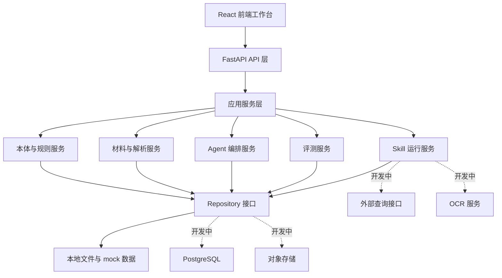
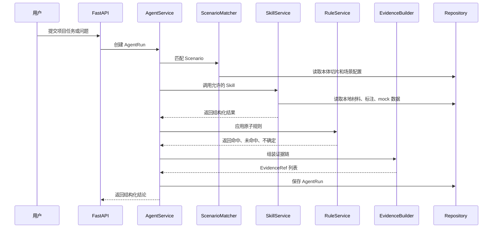

# Onto Pro 技术选型与架构设计

版本：v0.1  
日期：2026-06-02  
状态：技术方案草案  
关联文档：`05-Onto Pro平台产品需求文档.md`

## 1. 设计结论

一期采用 `React + Python + PostgreSQL` 作为目标技术栈，但第一个可运行版本以本地文件和离线样例为主。

核心判断：

| 领域 | 一期实现 | 目标演进 |
| --- | --- | --- |
| 前端 | React + TypeScript + Vite | 保持 React 技术栈，按业务模块拆分 |
| 后端 | Python + FastAPI | 保持 Python 服务层，便于接 LLM、解析、评测和算法工具 |
| 数据库 | 本地 JSON/YAML/mock 数据优先 | PostgreSQL 作为正式元数据存储，接口先预留 |
| 对象存储 | 本地文件目录优先 | S3/MinIO/客户对象存储，接口先预留 |
| OCR | 人工标注结构模拟 | 后续接第三方 OCR 或客户 OCR 服务 |
| 外部接口 | 离线样例与 mock API | 后续接工商、司法、中登、发票、客户统一业务系统 |
| 部署 | 内部交付代管 | 后续支持客户私有化或内网部署 |

一期目标不是把所有基础设施一次搭完，而是先把“本体定义、场景推理、证据链、评测闭环”的产品能力跑通。数据库、对象存储、OCR 和外部查询都要在代码结构中预留清晰接口，并在页面功能上标记为“开发中”。

## 2. 技术选型

### 2.1 前端

建议选型：

| 技术 | 用途 | 选择原因 |
| --- | --- | --- |
| React | 前端框架 | 团队熟悉，适合构建工作台、表格、表单、详情页和交互式评测界面 |
| TypeScript | 类型约束 | Agent 输出、EvalCase、本体模型都需要稳定结构 |
| Vite | 开发与构建 | 启动快，配置轻，适合 MVP |
| React Router | 页面路由 | 支持项目、材料、本体、规则、AgentRun、评测中心多页面 |
| TanStack Query | API 状态管理 | 适合服务端数据、运行状态、评测结果轮询 |
| Zustand | 局部 UI 状态 | 用于当前项目、侧边栏、证据面板、筛选状态 |
| React Hook Form + Zod | 表单与校验 | 本体、规则、Scenario、EvalCase 都需要结构化编辑 |
| TanStack Table | 表格 | 材料列表、对象实例、规则列表、评测列表需要高密度表格 |
| Mermaid 或 React Flow | 图形展示 | Mermaid 用于文档和简单流程，React Flow 后续用于推理图和关系图 |

UI 风格建议走“金融项目工作台”路线：信息密度高、状态清楚、证据可展开、避免营销式页面。

### 2.2 后端

建议选型：

| 技术 | 用途 | 选择原因 |
| --- | --- | --- |
| Python | 后端主语言 | 团队熟悉，适合文档解析、LLM 编排、评测、数据处理 |
| FastAPI | HTTP API | 类型友好，OpenAPI 自动生成，便于前后端并行 |
| Pydantic | 数据模型 | 可定义 Ontology、Scenario、Rule、AgentRun、EvalCase 的结构契约 |
| Uvicorn | 本地开发服务 | FastAPI 标准搭配 |
| SQLAlchemy | 目标数据库 ORM | 后续接 PostgreSQL 时降低迁移成本 |
| Alembic | 数据库迁移 | 正式启用 PostgreSQL 后使用 |
| pytest | 测试 | 覆盖解析、规则、Skill、评测和 API |
| structlog/loguru | 运行日志 | AgentRun 和 Skill 调用需要可追踪日志 |

第一个版本可以暂不启用真实数据库，但后端代码应从第一天开始按 Repository 接口写，避免未来从本地文件迁移到 PostgreSQL 时重写业务逻辑。

### 2.3 持久化策略

一期采用双层设计：

| 层 | 一期实现 | 说明 |
| --- | --- | --- |
| MetadataRepository | LocalMetadataRepository | 读写本地 JSON/YAML，用于 Workspace、Project、Ontology、Scenario、Rule、EvalCase |
| FileRepository | LocalFileRepository | 读写本地材料目录和解析结果 |
| ObjectStorageRepository | MockObjectStorageRepository | 接口存在，页面标记开发中 |
| ExternalDataRepository | MockExternalDataRepository | 返回离线样例，用于工商、司法、中登、发票等查询 |
| PostgresRepository | 开发中 | 保留接口与模型映射，正式化后接 PostgreSQL |

建议本地目录结构：

```text
data/
  workspaces/
    default/
      projects/
        project-qsl-001/
          documents/
          annotations/
          extraction/
          agent_runs/
      ontology/
        ontology_versions/
        rules/
        scenarios/
      eval/
        suites/
        runs/
      external_samples/
```

## 3. 总体架构



分层原则：

| 层级 | 职责 |
| --- | --- |
| UI 层 | 展示项目、材料、本体、规则、AgentRun、EvalRun；不写业务判断 |
| API 层 | 提供稳定 HTTP 契约、鉴权入口、请求校验 |
| 应用服务层 | 编排业务流程，例如上传材料、生成草案、运行场景、保存反馈 |
| 领域服务层 | 处理本体、规则、评测、Skill、证据链等核心逻辑 |
| Repository 层 | 屏蔽本地文件、PostgreSQL、对象存储、外部接口差异 |
| 运行层 | Agent、LLM、Skill、规则引擎、评测执行 |

## 4. 后端模块设计

建议目录：

```text
backend/
  app/
    main.py
    api/
      routes_projects.py
      routes_documents.py
      routes_ontology.py
      routes_scenarios.py
      routes_agent.py
      routes_eval.py
      routes_skills.py
    core/
      config.py
      errors.py
      logging.py
    domain/
      models/
      services/
      schemas/
    repositories/
      base.py
      local_metadata.py
      local_files.py
      mock_external.py
      postgres.py
    skills/
      document_extract.py
      material_check.py
      contract_compare.py
      finance_calc.py
      disbursement_check.py
      mock_external_query.py
    agent/
      scenario_matcher.py
      planner.py
      runner.py
      evidence.py
    eval/
      runner.py
      graders.py
      boundary_tags.py
  tests/
```

### 4.1 核心服务

| 服务 | 职责 |
| --- | --- |
| ProjectService | Workspace、Project、项目状态、样例项目初始化 |
| DocumentService | 本地文件登记、材料类型识别、人工标注读取、字段抽取结果保存 |
| OntologyService | ObjectType、RelationType、State、Rule、Scenario、OntologyVersion 管理 |
| RuleService | 原子规则校验、规则命中、规则测试 |
| SkillService | Skill 注册、输入输出校验、运行记录 |
| AgentService | 场景匹配、工具规划、规则应用、证据汇总、结构化输出 |
| EvalService | EvalCase 管理、批量运行、评分、L0-L7 失败归因 |

### 4.2 Agent 运行流程



## 5. 前端模块设计

建议目录：

```text
frontend/
  src/
    app/
      router.tsx
      providers.tsx
    api/
      client.ts
      types.ts
    pages/
      projects/
      documents/
      ontology/
      scenarios/
      agent-runs/
      eval/
      settings/
    components/
      layout/
      tables/
      forms/
      evidence/
      status/
    stores/
    utils/
```

一期页面：

| 页面 | P0 内容 | 开发中标记 |
| --- | --- | --- |
| 项目列表 | 项目、新建、样例初始化、状态 | 客户系统同步 |
| 项目工作台 | 摘要、材料、任务入口、风险结果 | 多系统实时状态 |
| 材料中心 | 本地文件列表、类型、字段、人工标注 | OCR、对象存储 |
| 本体工作台 | 对象、关系、规则、场景、版本 | 图谱编辑器 |
| AgentRun 详情 | 场景、Skill、规则、证据、结论 | 自动执行动作 |
| 评测中心 | EvalCase、运行、评分、L0-L7 | 自动生成边界用例 |
| 设置页 | mock 数据、Skill 开关、模型配置 | 企业 SSO、正式权限 |

## 6. API 设计

接口先按资源聚合，保证前端可并行开发。

### 6.1 项目与材料

| 方法 | 路径 | 说明 |
| --- | --- | --- |
| GET | `/api/projects` | 项目列表 |
| POST | `/api/projects` | 创建项目 |
| GET | `/api/projects/{project_id}` | 项目详情 |
| POST | `/api/projects/{project_id}/documents` | 登记本地材料或上传材料 |
| GET | `/api/projects/{project_id}/documents` | 材料列表 |
| POST | `/api/documents/{document_id}/parse` | 解析材料，第一版读取人工标注结构 |
| GET | `/api/documents/{document_id}/extraction` | 字段抽取结果 |

### 6.2 本体、规则与场景

| 方法 | 路径 | 说明 |
| --- | --- | --- |
| GET | `/api/ontology/versions` | 本体版本列表 |
| POST | `/api/ontology/versions` | 创建本体版本 |
| GET | `/api/ontology/object-types` | 对象类型列表 |
| GET | `/api/ontology/relation-types` | 关系类型列表 |
| GET | `/api/rules` | 规则列表 |
| POST | `/api/rules/{rule_id}/test` | 单规则测试 |
| GET | `/api/scenarios` | 场景列表 |
| POST | `/api/scenarios/{scenario_id}/dry-run` | 场景试运行 |

### 6.3 Agent 与评测

| 方法 | 路径 | 说明 |
| --- | --- | --- |
| POST | `/api/agent/runs` | 创建 AgentRun |
| GET | `/api/agent/runs/{run_id}` | AgentRun 详情 |
| POST | `/api/agent/runs/{run_id}/feedback` | 保存用户反馈 |
| GET | `/api/eval/suites` | 评测套件列表 |
| POST | `/api/eval/runs` | 创建 EvalRun |
| GET | `/api/eval/runs/{eval_run_id}` | 评测结果 |
| POST | `/api/eval/cases/from-agent-run/{run_id}` | 从 AgentRun 保存 EvalCase |

## 7. 核心数据契约

### 7.1 AgentRun 输出

```json
{
  "run_id": "run_001",
  "project_id": "project_qsl_001",
  "matched_scenario": {
    "id": "scenario.leasing_risk_review",
    "name": "融资租赁尽调与风险审查",
    "confidence": 0.91
  },
  "facts_used": [],
  "skills_called": [],
  "rules_applied": [],
  "reasoning_trace": [],
  "evidence": [],
  "uncertainty": [],
  "conclusion": {
    "summary": "",
    "risk_level": "manual_review"
  },
  "recommended_actions": []
}
```

### 7.2 EvidenceRef

```json
{
  "evidence_id": "ev_001",
  "source_type": "document",
  "source_id": "doc_001",
  "location": {
    "page": 3,
    "field": "融资金额"
  },
  "value": "10000000",
  "confidence": 0.96,
  "input_quality": "manual_annotation"
}
```

### 7.3 EvalCase

```json
{
  "case_id": "eval.finance.leasing.001",
  "priority": "P0",
  "scenario_id": "scenario.leasing_risk_review",
  "project_id": "project_qsl_001",
  "input": {
    "question": "请判断该项目放款前置条件是否满足"
  },
  "expected": {
    "rules_applied": [],
    "conclusion_contains": [],
    "evidence_refs": []
  },
  "boundary_tags": {
    "ontology_depth": "L5",
    "input_quality": "manual_annotation"
  }
}
```

## 8. 本地文件与 mock 策略

一期需要三类样例：

| 样例 | 用途 |
| --- | --- |
| 金融项目材料样例 | 驱动材料中心、字段抽取、本体草案 |
| 人工标注结构 | 模拟 OCR 和字段抽取结果，避免把 OCR 质量混入本体评测 |
| 外部查询 mock | 模拟工商、司法、中登、发票、客户台账接口 |

页面标记规则：

| 功能 | 页面标记 |
| --- | --- |
| OCR 自动识别 | 开发中 |
| 对象存储上传 | 开发中 |
| PostgreSQL 正式持久化 | 开发中 |
| 客户统一业务系统同步 | 开发中 |
| 外部查询实时接口 | 开发中 |
| 企业权限/SSO | 开发中 |

## 9. PostgreSQL 目标模型

虽然一期不强依赖 PostgreSQL，但目标表结构应提前对齐。

| 表 | 说明 |
| --- | --- |
| workspaces | 工作空间 |
| projects | 金融项目 |
| documents | 材料元数据 |
| document_extractions | 字段抽取结果 |
| ontology_versions | 本体版本 |
| ontology_elements | 对象、属性、关系、状态等本体元素 |
| rules | 原子规则 |
| scenarios | 场景配置 |
| skills | Skill 注册表 |
| agent_runs | Agent 运行 |
| reasoning_steps | 推理步骤 |
| evidence_refs | 证据引用 |
| eval_suites | 评测套件 |
| eval_cases | 评测用例 |
| eval_runs | 评测运行 |
| eval_results | 评测结果 |
| feedback_items | 用户反馈 |

迁移策略：

1. 先用 Pydantic 模型定义领域对象。
2. LocalRepository 读写 JSON/YAML。
3. PostgreSQL 接入时新增 SQLAlchemy 映射。
4. 保持 API 响应结构不变。

## 10. 测试策略

| 测试类型 | 一期要求 |
| --- | --- |
| 单元测试 | 规则命中、字段解析、EvidenceRef、EvalCase 评分 |
| API 测试 | 项目、材料、本体、AgentRun、EvalRun 主路径 |
| 样例回归 | 10-20 条 P0 EvalCase 必须稳定通过 |
| 前端冒烟 | 项目列表、材料中心、AgentRun 详情、评测中心能打开并展示 mock 数据 |
| 边界测试 | L0-L7 失败归因必须可记录 |

一期准入线建议：

| 指标 | 内部试用门槛 |
| --- | --- |
| P0 EvalCase 通过率 | >= 85% |
| P0 证据引用准确率 | >= 90% |
| 输出结构合法率 | 100% |
| 无证据确定性结论 | 0 个 |
| 高风险动作自动执行 | 0 个 |

## 11. 开发里程碑

| 迭代 | 目标 | 交付 |
| --- | --- | --- |
| Sprint 0 | 工程骨架 | React/Vite、FastAPI、本地 data 目录、mock API、基础页面框架 |
| Sprint 1 | 项目与材料中心 | 项目列表、样例项目、材料列表、人工标注读取、字段展示 |
| Sprint 2 | 本体与规则工作台 | 对象、关系、规则、场景配置、本体版本 |
| Sprint 3 | AgentRun 闭环 | 任务入口、场景匹配、Skill 调用、规则应用、证据面板 |
| Sprint 4 | 评测中心 | EvalCase、EvalRun、P0/P1/P2、L0-L7、失败归因 |
| Sprint 5 | 金融样板演示 | 租赁闭环、保理样板、演示数据、内部交付手册 |

## 12. 需要暂不做的事

| 暂不做 | 原因 |
| --- | --- |
| 复杂图谱编辑器 | MVP 用表格、表单和结构化文本即可验证核心能力 |
| 实时 OCR | 人工标注结构更适合先验证本体和推理边界 |
| 真实外部查询 | 接口契约先行，离线样例足够支撑第一阶段评测 |
| 正式对象存储 | 本地文件可以支撑内部交付代管 |
| 企业级权限体系 | 一期保留角色字段和审计模型，先不做复杂 SSO |

## 13. 仍需设计的下一层文档

建议接下来继续输出三份开发前置文档：

| 文档 | 作用 |
| --- | --- |
| `07-前后端接口契约.md` | 把 API 请求、响应、错误码、mock 数据固定下来 |
| `08-工程目录与开发任务拆解.md` | 明确前后端目录、任务包、开发顺序 |
| `09-本地样例数据规范.md` | 规定金融材料、人工标注、EvalCase、外部查询 mock 的文件格式 |
